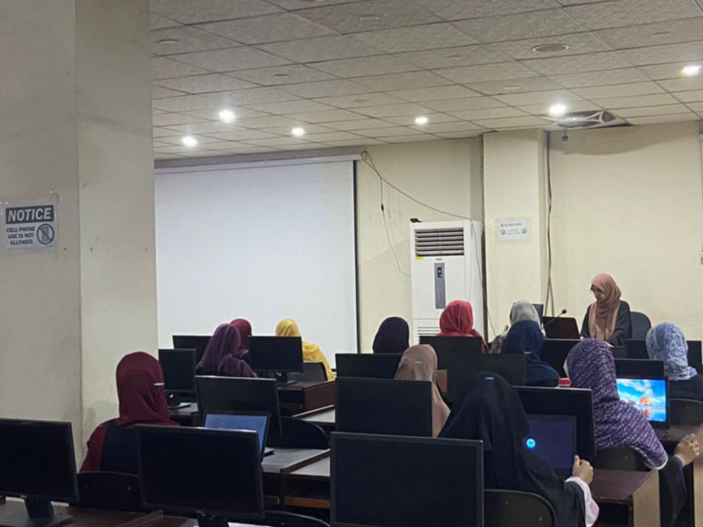

  

# **Web Development Course (One-Year)**

Welcome to the One-Year Web Development Course! This course is designed to take you from beginner to advanced in web development, covering front-end technologies like HTML, CSS, JavaScript, Bootstrap, Tailwind CSS, and React.js with hooks, as well as Firebase integration for building full-stack applications.

## **Course Structure**

### **Module 1: HTML & CSS**
In this module, you will learn the building blocks of the web:
- **HTML** (Hypertext Markup Language): The structure of web pages.
- **CSS** (Cascading Style Sheets): The styling of web pages.

**Topics Covered**:
- Basic HTML tags and structure.
- CSS syntax, selectors, and units.
- Box model, positioning, and layout.
- Flexbox and Grid for responsive design.
- Media queries for different screen sizes.

---

### **Module 2: JavaScript (JS)**
In this module, you will learn the core programming language of the web:
- **JavaScript**: The behavior and interactivity of web pages.

**Topics Covered**:
- JavaScript fundamentals: variables, data types, operators, and control structures.
- Functions, arrays, objects, and loops.
- DOM manipulation: Accessing and modifying elements on the page.
- Event handling and form validation.
- ES6+ features: Arrow functions, destructuring, promises, and async/await.

---

### **Module 3: CSS Frameworks - Bootstrap, Tailwind CSS, and Sass**
This module will introduce you to modern CSS frameworks to streamline your styling process:
- **Bootstrap**: A popular CSS framework for responsive design.
- **Tailwind CSS**: A utility-first CSS framework.
- **Sass**: A CSS preprocessor for writing cleaner, more maintainable styles.

**Topics Covered**:
- Using Bootstrap for layouts, components, and utilities.
- Customizing Tailwind classes for fast UI development.
- Writing and compiling Sass to CSS, using variables, mixins, and functions.

---

### **Module 4: React.js with Hooks**
In this module, you will learn how to build dynamic user interfaces using React:
- **React.js**: A popular JavaScript library for building user interfaces.

**Topics Covered**:
- React basics: JSX, components, and props.
- Functional components vs. class components.
- Managing state with the `useState` hook.
- Handling side effects with the `useEffect` hook.
- React Router for navigation between pages.
- Building reusable components and managing global state.
  
---

### **Module 5: Firebase Integration**
This module introduces Firebase for building full-stack web applications:
- **Firebase**: A Backend-as-a-Service (BaaS) platform by Google.

**Topics Covered**:
- Setting up a Firebase project.
- Firebase Authentication: Implementing user login and registration.
- Firebase Firestore: Storing and retrieving data from the cloud.
- Firebase Hosting: Deploying React applications to the web.
  

---

## **Tools and Technologies**
- **HTML5**
- **CSS3**
- **JavaScript (ES6+)**
- **Bootstrap**
- **Tailwind CSS**
- **Sass**
- **React.js**
- **Firebase**

---
Happy Coding!

